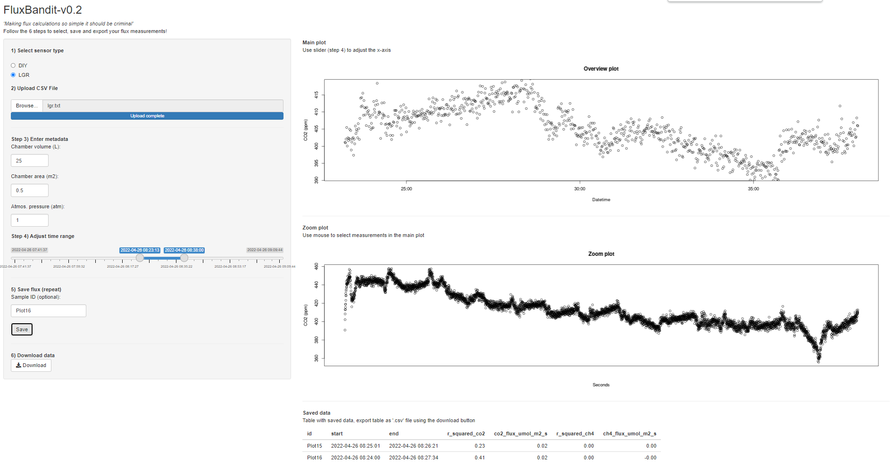

# FluxBandit

## Shiny app for interactive processing and calculation of greenhouse gas emissions 

### What is it

A single page R-script containing a Shiny app to perform processing of greenhouse gas flux measurements (CO2 and CH4) in chambers using interactive plots. The application currently supports the following sensor systems:

* LGR: Los Gatos Research - ultraportable/microportable analyzers

* DIY: Do-it-yourself type [sensors](https://bg.copernicus.org/articles/17/3659/2020/bg-17-3659-2020.pdf)

* LICOR: Licor GHG analyzer

However, it is easy to extend the functionality. See the 'app.R' file for examples if parser functions for how to add a custom parser.

### Steps

The app takes the user through all the necessary steps to calculate CO2 and CH4 fluxes:

1.  Select sensor type

2.  Import data (‘.csv’ or ‘.txt’ file)

3.  Adjust metadata

4.  Define measurement:

    -   Select time range using slider (coarse adjustment)

    -   Select time range interactively in *Overview plot* (fine adjustment)

    -   Inspect selection in *Zoom plot* and adjust if necessary

5.  Save measurement (repeat steps 2-4)

6.  Download data the results as a '.csv' file

### Running the app

There are two options for using the app:

1.  Run the app [online](https://kennethtm.shinyapps.io/FluxBandit/).

2.  Download this repository as a '.zip', unzip the contents, launch RStudio, open the 'app.R' script, and hit the 'Run App' button. The application requires a few packages which can be installed using this command from R: `install.packages(c("shiny", "dplyr", "lubridate"))`

Try out the functionality using the example files included in the 'demo/' folder.

### Release notes

v0.7 - Added initial support for a LICOR analyzer.

v0.6 - Fixed an error which could result in time zone changes when exporting results.

v0.5 - Fixed an error in the flux calculation which resulted in incorrect values for CO2 and CH4 fluxes in the previous versions.

### How to cite

### Contact

Kenneth Thorø Martinsen (kenneth2810@gmail.com)
