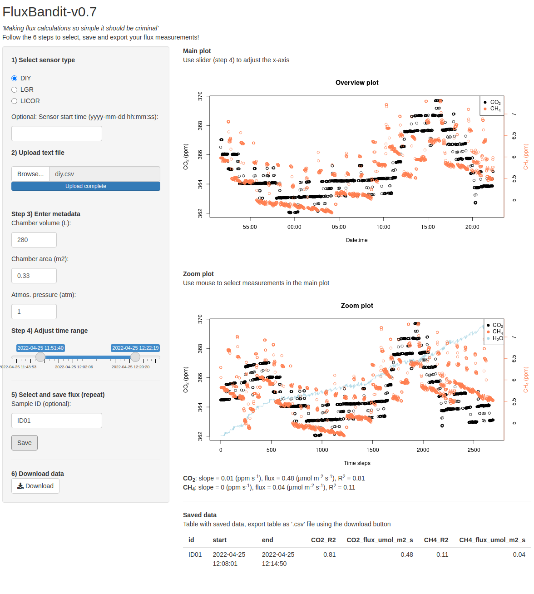

# FluxBandit

## Shiny app for interactive processing and calculation of greenhouse gas emissions 

### What is it

App used to perform manual processing of greenhouse gas flux measurements using interactive plots of both commercial and DIY type sensor systems.

The app takes the user through all the necessary steps:

1.  Select sensor type

2.  Import data (‘.csv’ file)

3.  Adjust metadata

4.  Define measurement:

    -   Select time range using slider (coarse adjustment)

    -   Select time range interactively in *Overview plot* (fine adjustment)

    -   Inspect selection in *Zoom plot* and adjust if necessary

5.  Save measurement (repeat steps 2-4)

6.  Download data the results as a ‘.csv’ file

### Running the app

There are two options for using the app:

1.  Run the app [online](https://kennethtm.shinyapps.io/FluxBandit/).

2.  Download this repository as a '.zip' file and run in e.g. RStudio. Make sure to have the required packages installed.

### Contact

Kenneth Thorø Martinsen (kenneth2810@gmail.com)
